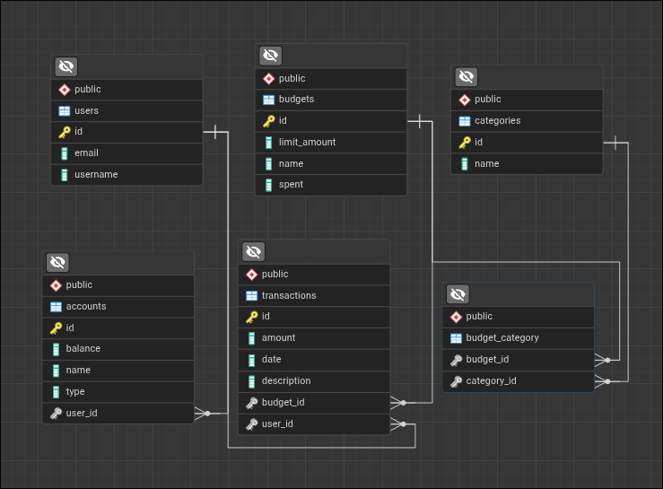

# Finance Tracker

**Finance Tracker** — это приложение для управления личными финансами, которое помогает пользователям контролировать доходы и расходы, а также анализировать своё финансовое состояние. Система предоставляет REST API для работы с данными о пользователях, счетах, транзакциях, категориях и бюджетах, обеспечивая удобное и структурированное взаимодействие с финансовой информацией.

**Стек:** Java 17 · Spring Boot 4 · Spring Data JPA · PostgreSQL

---

## Связи сущностей



---

## API Endpoints

Полная документация API находится: [Документация API](docs/api.md)

## Запуск приложения

### 1. Переменные окружения

Приложение поддерживает запуск через env-переменные:

- `SERVER_PORT` (по умолчанию `8080`)
- `APP_SEED_DEMO_DATA` (по умолчанию `false`, заполняет БД демо-данными при пустой таблице `users`)
- `DB_URL` (опционально, если задана, имеет приоритет над `DB_HOST/DB_PORT/DB_NAME`)
- `DB_HOST` (по умолчанию `localhost`)
- `DB_PORT` (по умолчанию `5432`)
- `DB_NAME` (по умолчанию `finance_tracker`)
- `DB_USERNAME` (по умолчанию `postgres`)
- `DB_PASSWORD` (по умолчанию пусто)

### 2. Локальный запуск (без Docker)

Убедитесь, что PostgreSQL запущен локально на `localhost:5432`, затем создайте БД:

```sql
CREATE DATABASE finance_tracker;
```

Пример запуска приложения:

```bash
DB_HOST=localhost DB_PORT=5432 DB_NAME=finance_tracker DB_USERNAME=postgres DB_PASSWORD=postgres ./mvnw spring-boot:run
```

Если у вашего пользователя `postgres` другой пароль, подставьте его вместо `postgres`.

### 3. Запуск через Docker (только приложение)

```bash
docker build -t finance-tracker:local .
docker run --rm -p 8080:8080 \
  -e DB_HOST=host.docker.internal \
  -e DB_PORT=5432 \
  -e DB_NAME=finance_tracker \
  -e DB_USERNAME=postgres \
  -e DB_PASSWORD=postgres \
  finance-tracker:local
```

### 4. Запуск через Docker Compose (бэкенд + фронтенд + БД)

1. Создайте `.env`:

```bash
cp .env.example .env
```

2. При необходимости поменяйте значения в `.env` (например `DB_PASSWORD`).
   В `docker-compose.yml` переменная `DB_USER` автоматически пробрасывается в приложение как `DB_USERNAME`.
   По умолчанию `APP_SEED_DEMO_DATA=true`: при первом старте на пустой БД создаются 10 пользователей
   с аккаунтами, категориями, бюджетами и транзакциями.

3. Соберите backend JAR:

```bash
./mvnw -Dmaven.test.skip=true clean package
```

4. Поднимите сервисы:

```bash
docker compose up --build
```

5. Проверка:
- Frontend: `http://localhost:5173`
- API: `http://localhost:8080`
- Swagger UI: `http://localhost:8080/swagger-ui.html`

Остановить сервисы:

```bash
docker compose down
```

## Транзакции и Entity Graph

**Транзакции:** создание пользователя с несколькими счетами и бюджетами (`POST /api/v1/users/create-accounts-and-budgets`) можно выполнять в одной транзакции (`?transactional=true`) — при ошибке всё откатывается; без транзакции (`?transactional=false`) при сбое в БД остаются частично сохранённые данные. Для демонстрации атомарности есть флаг `failAfterAccounts=true` в теле запроса: приложение падает сразу после сохранения всех счетов, до сохранения бюджетов.

**Модель транзакций:** у транзакций используется `occurredAt` (`LocalDateTime`), денежные поля переведены на `BigDecimal/NUMERIC(19,2)`, добавлены типы операций (`INCOME`, `EXPENSE`, `TRANSFER`) и обязательная связь с аккаунтом.

**Модель бюджетов:** у бюджетов есть временные рамки `periodStart`/`periodEnd`, и расчёт `spent` выполняется только по расходам (`EXPENSE`) внутри этого интервала.

**Entity Graph:** для демонстрации N+1 в транзакциях используется `@EntityGraph` для списка транзакций:
`GET /api/v1/transactions?withEntityGraph=true`.
